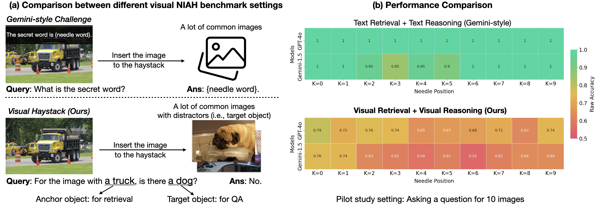

# Visual Haystacks: Answering Harder Questions About Sets of Images

[](https://www.python.org/downloads/release/python-310/)
[](https://github.com/ambv/black)

This repo provides the benchmark toolkit of our proposed Visual Haystacks (VHs) dataset: [Visual Haystacks: Answering Harder Questions About Sets of Images](https://arxiv.org/abs/xxxx.xxxxx). Check out project page [here](https:/xxxxxx.github.io/)!

**Authors**: [Tsung-Han Wu](https://tsunghan-wu.github.io/), [Giscard Biamby](https://scholar.google.com/citations?user=s0Fof5IAAAAJ&hl=en), [Jerome Quenum](https://people.eecs.berkeley.edu/~jquenum/), [Ritwik Gupta](https://ritwikgupta.me/), [Joseph E. Gonzalez](https://people.eecs.berkeley.edu/~jegonzal/), [Trevor Darrell](https://people.eecs.berkeley.edu/~trevor/), [David M. Chan](https://dchan.cc/) at UC Berkeley. 

Visual Haystacks (VHs) is a "visual-centric" Needle-In-A-Haystack (NIAH) benchmark specifically designed to evaluate the capabilities of Large Multimodal Models (LMMs) in visual retrieval and reasoning over sets of unrelated images. Unlike conventional NIAH challenges that center on text-related retrieval and understanding with limited anecdotal examples, VHs contains a much larger number of examples and focuses on "simple visual tasks", providing a more accurate reflection of LMMs' capabilities when dealing with extensive visual context.

We encourage researchers and practitioners in the field of ML-CV/NLP to engage with the Visual Haystacks (VHs) benchmark. By leveraging this dataset, we can collectively push the envelope in developing LMMs that are not only proficient in text but also excel in processing and reasoning with long-context visual information. Check out VHs at [🤗 tsunghanwu/visual_haystacks](https://huggingface.co/datasets/tsunghanwu/visual_haystacks)!

## :crystal_ball: Benchmark Dataset Details

VHs consists of approximately 1K binary visual question-answer pairs for sets containing differeing numbers images, with each set ranging from 1 to 10K images. Each question is about the presence of an object in some relevant images: the model needs to first retrieve these needle images in a haystack of data and then answer the corresponding question. The dataset is carefully curated to ensure that guessing or relying on common sense reasoning without viewing the image results in a 50% accuracy rate. The dataset is derived from the COCO dataset and includes two types of challenges: the single-needle challenge and the multi-needle challenge.

-   **Single-Needle Challenge**: Only a single needle image exists in the haystack of images. The question is framed as, "For the image with the anchor object, is there a target object?"
-   **Multi-Needle Challenge**: Two to five needle images exist in the haystack of images. The question is framed as either, "For all images with the anchor object, do all of them contain the target object?" or "For all images with the anchor object, do any of them contain the target object?"



## :rocket: Interesting Applications/Findings

1. **Enhanced Evaluation for LMMs**: VHs reveals that existing open-source and proprietary LMMs struggle significantly with long-context visual input compared to long-context textual information. This highlights a critical gap in the current capabilities of LMMs.
2. **Phenomena in Visual Domain**: We identify a ["lost-in-the-middle"](https://arxiv.org/abs/2307.03172) style phenomenon in the visual domain. Future LMM solutions might need to consider this issue when training their models.
3. **MIRAGE**: Our proposed method, MIRAGE, is a pioneering open-source visual-RAG solution designed to address these problems effectively. (We will release the code soon!)

## :rotating_light: Status Updates

- **07/18/2024:** We provide scripts to run inference for various methods on VHs, including GPT-4, Gemini, Claude, LLaVA, QwenVL, Idefics2, and more. 
- Upcoming release plans:
  - [ ] Update logs/results for the latest model iterations. (The [experimental results](https://drive.google.com/drive/folders/1jvu6H40aQx3yXbM6AZ0mDCltnWIOOxrz?usp=sharing) reported in our paper was collected during this April and May. We recently found that some proprietary models have improved a lot.)
  - [ ] Publish the MIRAGE codebase.

We encourage those working on multi-image reasoning to contact us to merge their latest model into this repo!

## :wrench: Development Kits

### Preparation

1. **Package Installation**

```sh
pip3 install -r requirements.txt
```

2. **Data Preparation**
  - Download the VQA questions from [🤗 tsunghanwu/visual_haystacks](https://huggingface.co/datasets/tsunghanwu/visual_haystacks). Our data structure is similar to LLaVA's one, which is easy to play with. `huggingface-cli download --repo-type dataset tsunghanwu/visual_haystacks --local-dir dataset/VHs_qa`
  - Download the COCO 2017 dataset and organize it as follows, with the default root directory ./dataset/coco:

```
dataset/
├── coco
│   ├── annotations
│   ├── test2017
│   └── val2017
└── VHs_qa
    ├── VHs_full
    │   ├── multi_needle
    │   └── single_needle
    └── VHs_small
        ├── multi_needle
        └── single_needle
```

### Execution

Run the script:

```sh
python3 main.py
```

Note:

-   Add your OpenAI and Google API key to `conf/solver/*.yaml`.
-   This all-in-one script will run inference and then go through evaluation.
-   Modify configs in `conf/` if needed. Please refer to [hydra's document](https://hydra.cc/) for more information if required as we use this tool in the project.

### Explanations on the config

```
defaults:
  - solver: llava # which solve we're gonna use
  - _self_

basic:
  debug_mode: False     # debug mode or not (use only single instsace to prevent spending $$$)
  mode: single_needle   # single_needle/multi_needle
  image_root: dataset   # dataset root directory
  test_file_base: dataset/VHs_qa/VHs_full/single_needle   # all json files are put in this directory
  output_dir: output/${solver.name}_${basic.mode}/result  # output result directory (saving jsons)
  image_counts: ["oracle", 2, 3]    # we will read the json file named as "visual_haystack_{entry}.json"

hydra:
  run:
    dir: output/${solver.name}_${basic.mode}/logs   # log dir
```

## :dart: Citation

If you use our work or our implementation in this repo, or find them helpful, please consider giving a citation.
```
@article{wu2024visual,
  title={Visual Haystacks: Answering Harder Questions About Sets of Images},
  author={Wu, Tsung-Han and Biamby, Giscard and and Quenum, Jerome and Gupta, Ritwik and Gonzalez, Joseph E and Darrell, Trevor and Chan, David M},
  journal={arXiv preprint arXiv:xxxx.xxxxx},
  year={2024}
}
```